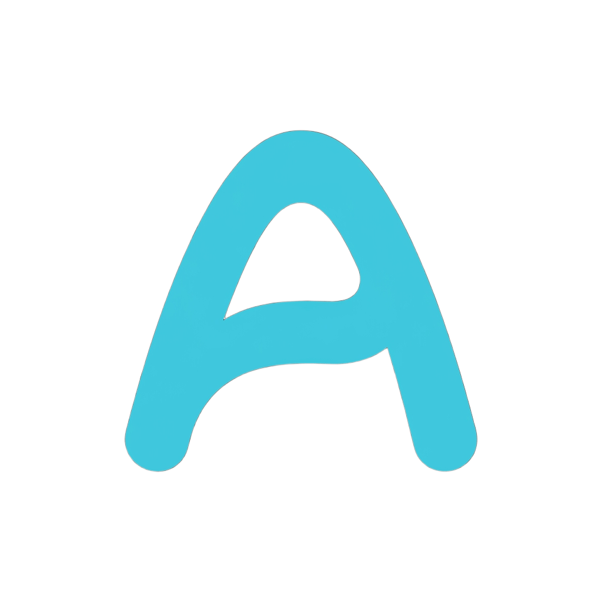

<div align="center">

  

  # Arthur Ramos — Web Portfolio & Engineering Showcase

  <p align="center">
    <strong>High-performance, interactive personal web platform engineered with modern frontend architecture.</strong>
  </p>

  <p align="center">
    <a href="https://www.arthur-moreira-ramos.com.br" target="_blank"><strong>🌐 View Live Platform</strong></a> •
    <a href="https://www.linkedin.com/in/arthur-moreira-ramos/" target="_blank"><strong>LinkedIn</strong></a> •
    <a href="https://github.com/arthurramoz" target="_blank"><strong>GitHub</strong></a> •
    <a href="mailto:arthurmoreiraramosdev@gmail.com"><strong>Contact</strong></a>
  </p>

  <p align="center">
    
    
    
    
    
    
  </p>

</div>

---

## ⚡ Overview

This repository hosts the source code for my personal web platform, live at **[arthur-moreira-ramos.com.br](https://www.arthur-moreira-ramos.com.br)**. 

Engineered from scratch to demonstrate **enterprise-grade frontend architecture**, ultra-smooth micro-interactions, responsive accessibility, and multi-language internationalization (i18n), it serves both as my commercial portfolio and as a live technical benchmark.

---

## 🚀 Key Highlights & Engineering Features

### 🌍 Zero-Reload Multi-Language Engine (i18n)
- Custom client-side internationalization system supporting **5 languages**:
  - 🇧🇷 **Portuguese (pt)**
  - 🇺🇸 **English (en)**
  - 🇪🇸 **Spanish (es)**
  - 🇫🇷 **French (fr)**
  - 🇷🇺 **Russian (ru)**
- Instant language switching with state persistence in `localStorage`, zero layout shifts, and full SSR metadata synchronization.

### 🎨 Fluid Micro-Interactions & Canvas Visuals
- **Interactive 3D Wave Orb:** Custom Canvas-based interactive particle mesh with cursor proximity physics and real-time animation loops.
- **Micro-Animations:** Fluid enter/exit transitions and staggered orchestrations powered by `motion/react`.
- **Floating Particles & Sparkles:** Non-blocking ambient background visual effects optimized for GPU acceleration.

### 🌓 Dual Theme Architecture (Light & Dark Mode)
- Dynamic theme switching via `styled-components` `ThemeProvider`.
- Cookie & `localStorage` persistence with server-side stylesheet hydration to eliminate **Flash of Unstyled Content (FOUC)**.

### 📱 100% Responsive & Mobile-First UX
- Pixel-perfect responsiveness across desktop, tablet, and mobile breakpoints.
- Custom mobile drawer navigation, tactile touch interactions, and fluid typography.

### 🔍 Production-Ready SEO & Web Standards
- Dynamic XML Sitemaps generated via `next-sitemap`.
- Open Graph & Twitter Cards metadata for rich social previews.
- Structured JSON-LD Schema.org markup for enhanced search engine indexing.
- Semantic HTML5 and accessibility (a11y) best practices.

---

## 🛠️ Tech Stack & Architecture

| Layer | Technologies |
|---|---|
| **Framework & Core** | [Next.js 15](https://nextjs.org/) (App Router), [React](https://react.dev/), [TypeScript](https://www.typescriptlang.org/) |
| **Styling & Theming** | [Styled-Components](https://styled-components.com/) with SSR registry, CSS Grid/Flexbox |
| **Motion & Graphics** | [Motion](https://motion.dev/) (Framer Motion), HTML5 Canvas 2D Context |
| **State & Data Fetching** | React Context API, [TanStack React Query](https://tanstack.com/query), [Axios](https://axios-http.com/) |
| **Icons & UI Assets** | React Icons, Iconify, custom SVGs via `@svgr/webpack` |
| **Tooling & Code Quality** | Prettier, ESLint, TypeScript Strict Mode |

---

## 📂 Project Structure

```bash
├── public/                 # Static assets (images, logos, robots.txt, sitemaps)
├── src/
│   ├── app/                # Next.js App Router (pages, layout, metadata)
│   ├── components/         # Reusable UI components & section modules
│   │   ├── FloatingParticles/ # Canvas/DOM ambient particles
│   │   ├── Navbar/         # Responsive navigation & controls
│   │   ├── Pages/          # Page-specific views (Home, Projects, Cases, Skills, Contact)
│   │   └── ThemeToggle/    # Dark/Light mode theme switchers
│   ├── config/             # Projects data, skills catalogue, and site settings
│   ├── contexts/           # Global contexts (LanguageContext, ThemeContext)
│   ├── hooks/              # Custom reusable React hooks
│   ├── libs/               # Registry helpers (styled-components SSR collector)
│   ├── styles/             # Global styles, typography, theme tokens & design system
│   └── types/              # TypeScript definitions & data models
├── next-sitemap.config.js  # Dynamic sitemap configuration
└── LICENSE                 # Open-source MIT License with personal branding exclusion
```

---

## 💻 Getting Started

To run this project locally on your machine:

### Prerequisites
- Node.js **18.18+** or **20+**
- Package manager: `yarn` or `npm`

### Installation

1. **Clone the repository:**
   ```bash
   git clone https://github.com/arthurramoz/Portfolio.git
   cd Portfolio
   ```

2. **Install dependencies:**
   ```bash
   yarn install
   # or
   npm install
   ```

3. **Set up environment variables:**
   Create a `.env.local` file in the root directory:
   ```env
   NEXT_PUBLIC_GA_ID=your_google_analytics_id # optional
   ```

4. **Start the development server:**
   ```bash
   yarn dev
   # or
   npm run dev
   ```

5. **Open in browser:**
   Navigate to [http://localhost:3000](http://localhost:3000) to view the application.

---

## 📄 License

This repository is distributed under the **MIT License**. See the [LICENSE](LICENSE) file for complete details.

> **Note on Personal Assets:**  
> The underlying code and architectural patterns are open source. However, all personal branding, imagery, case study write-ups, and logos are strictly copyrighted © Arthur Moreira Ramos.

---

<div align="center">
  <sub>Designed & Developed with precision by <strong>Arthur Moreira Ramos</strong>.</sub>
</div>
